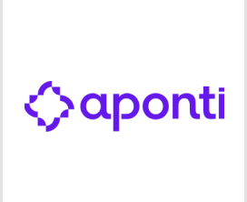

<div align="center">


<br/>


<br/><br/>

<p align="center">
  <a href="https://www.linkedin.com/in/erick-monteiro-23b5a2249"></a>
  <a href="https://gitlab.com/erickpxd"></a>
  <a href="mailto:erick.monteiroeflm@gmail.com"></a>
  <a href="https://www.youtube.com/channel/UCoRi2pXFmM16VkZ1qvy4X_w"></a>
  <a href="https://instagram.com/_erickmont"></a>
</p>

</div>

---

<h2 align="center">About me</h2>

```bash
erick@software-engineer:~$ whoami

Name:       Erick Fernando de Lima Monteiro
Role:       Software Developer @ Aponti
Education:  Software Engineering @ Jala University
Location:   Recife, Pernambuco, Brazil

```

---

<h2 align="center">GitHub Stats</h2>

<p align="center">
  <a href="https://github.com/erickpxd?tab=repositories">
    
  </a>

  <a href="https://github.com/erickpxd?tab=repositories">
    
  </a>
</p>

<p align="center">
  <a href="https://github.com/erickpxd"></a>
</p>

---

## Experiência Acadêmica


**Engenharia de Software** \
**Jala University** • Graduação \
`Fundamentos da Computação`, `Engenharia de Software`, `Desenvolvimento de Sistemas`, `Inteligência Artificial`. \
<br clear="left"/>

[](https://www.linkedin.com/in/ete-porto-digital-0645021a2/)

**Técnico em Desenvolvimento de Sistemas** \
[**ETE Porto Digital**](https://www.linkedin.com/in/ete-porto-digital-0645021a2/) • Curso técnico \
`Lógica de Programação`, `Desenvolvimento Web`, `Banco de Dados`, `Sistemas`. \
<br clear="left"/>

[](https://www.linkedin.com/company/apontipe/)

**Frontend React** \
[**Aponti**](https://www.linkedin.com/company/apontipe/) • Curso técnico \
`React`, `Componentização`, `Consumo de APIs`, `Interfaces Web`. \
<br clear="left"/>

[](https://www.linkedin.com/school/cesarschool/)

**CESAR Fast Frontend** \
[**CESAR School**](https://www.linkedin.com/school/cesarschool/) • Curso técnico \
`Frontend`, `JavaScript`, `React`, `Boas práticas de desenvolvimento`. \
<br clear="left"/>

---

## Experiência Profissional

[](https://www.linkedin.com/company/apontipe/)

**Residente Tecnológico Frontend (03/2026 - Atual)** \
[**Aponti**](https://www.linkedin.com/company/apontipe/) • Frontend \
`React`, `Angular`, `APIs REST`, `Arquitetura`, `DevOps`, `Metodologias Ágeis`. \
<br clear="left"/>

[](https://www.instagram.com/agencia_ph/)

**Equipe de TI (06/2022 - 12/2025)** \
[**Assessoria PH**](https://www.instagram.com/agencia_ph/) • Tecnologia \
`WordPress`, `Low-Code`, `Infraestrutura de Rede`, `Eventos`, `Liderança de TI`. \
<br clear="left"/>

[](https://www.instagram.com/inovegrafica2/)

**Designer Gráfico (11/2025 - 01/2026)** \
[**Inove Gráfica**](https://www.instagram.com/inovegrafica2/) • Design \
`Design Gráfico`, `Identidade Visual`, `Materiais Digitais`, `Produção Criativa`. \
<br clear="left"/>

[](https://www.instagram.com/cubho_digital/)

**Designer Gráfico e Gestão WordPress (09/2025 - 11/2025)** \
[**Cubho Digital**](https://www.instagram.com/cubho_digital/) • Design e Web \
`Design Gráfico`, `WordPress`, `Gestão de Conteúdo`, `Landing Pages`. \
<br clear="left"/>

[](https://www.instagram.com/dentalfacetas/)

**Designer Gráfico e Desenvolvimento de Saas (08/2023 - 01/2024)** \
[**Dental Facetas**](https://www.instagram.com/dentalfacetas/) • Operações Digitais \
`Administração de SaaS`, `Design Gráfico`, `Operações Digitais`, `Gestão Visual`. \
<br clear="left"/>
